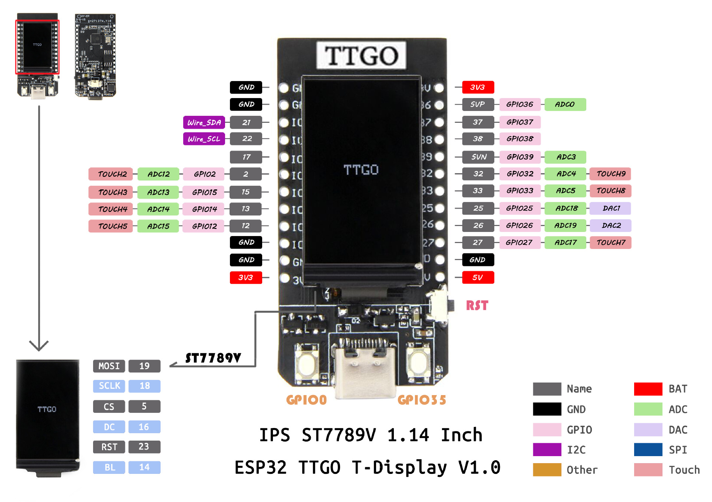
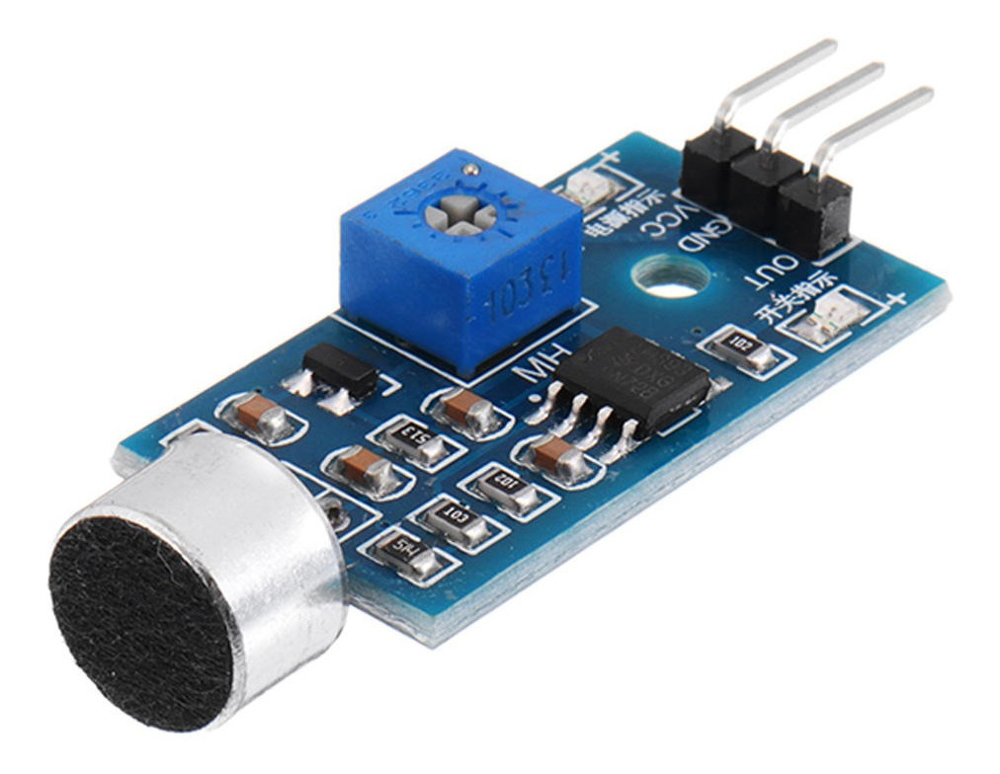

# esp32_data_acquisition
A simple esp32 sensor data acquisition program and accompanying python cli.

## Hardware
The board used is the [TTGO T-Display](https://github.com/Xinyuan-LilyGO/TTGO-T-Display), an ESP32 powered mcu module

For this example, the sensor used is a simple sound sensor attached supplied 3.3V, with its analog out hooked up to GPIO pin 32 of the mcu.

## Software

* esp32_data_acquisition
    * a program which, when flashed to the esp32, awaits a serial command telling it how long to record the sensor data for. The recorded data is then written over serial.
* serial_host.py
    * when run on the host machine, a serial connection is established and the user can send enter how many milliseconds to record for via the command line, before the result is read over serial and written to a file in the output folder ./data/

This is a basic demo and could be easily extended to other types of sensors/recordings